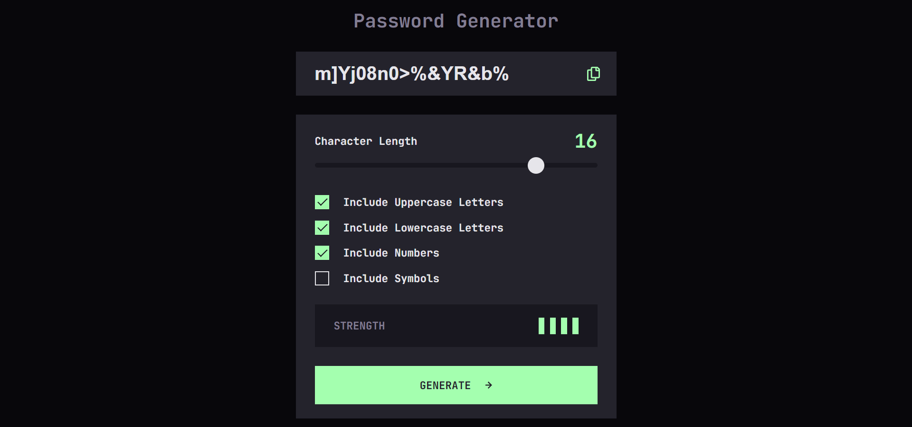

# Frontend Mentor - Password generator app solution

This is a solution to the [Password generator app challenge on Frontend Mentor](https://www.frontendmentor.io/challenges/password-generator-app-Mr8CLycqjh). Frontend Mentor challenges help you improve your coding skills by building realistic projects. 

## Table of contents

- [Overview](#overview)
  - [The challenge](#the-challenge)
  - [Screenshot](#screenshot)
  - [Links](#links)
- [My process](#my-process)
  - [Built with](#built-with)
  - [What I learned](#what-i-learned)
  - [Continued development](#continued-development)
  - [Useful resources](#useful-resources)
- [Author](#author)
- [Acknowledgments](#acknowledgments)

## Overview

### The challenge

Users should be able to:

- Generate a password based on the selected inclusion options
- Copy the generated password to the computer's clipboard
- See a strength rating for their generated password
- View the optimal layout for the interface depending on their device's screen size
- See hover and focus states for all interactive elements on the page

### Screenshot

### Links

- Solution URL: [Password Generator App](https://rohantgeorge.github.io/password-generator-app/)
- Live Site URL: [Password Generator App](https://rohantgeorge.github.io/password-generator-app/)

## My process

### Built with

- Semantic HTML5 markup
- CSS custom properties
- Flexbox
- CSS Grid
- Mobile-first workflow
- JavaScript
- jQuery

### What I learned

I learnt more about the "on click" event in jQuery and attr() method too. 
Also I learnt how to make custom checkboxes and use the copy functionality in JavaScript.

### Continued development

I had trouble with the progress background on active states.
I want to focus more on this and achieve this feature

### Useful resources

- [Range Slider Codepen](https://codepen.io/shashank_coder/pen/jOqxOpK) - This helped me to get the idea for the character length slider with numbering feature.
- [Password Generator](https://codepen.io/ShortCode/pen/jOzmwRm) - This is an amazing article which helped me understand the concept of COPY.

## Author

- Website - [Rohan T George](https://www.rohantgeorge.com/)
- Frontend Mentor - [@rohantgeorge](https://www.frontendmentor.io/profile/rohantgeorge)

